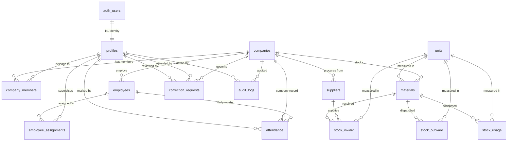

# KFAB BASIC — Hardened Database Architecture & Security Design

> [!NOTE]
> This document details the hardened production-ready PostgreSQL and Supabase database architecture for **KFAB BASIC**.
> **Status**: Local Architectural Design for Review (Not yet executed against remote Supabase).

---

## 1. Two-Level Administrative Hierarchy

```text
auth.users
    ↓
profiles
    ├── is_super_admin = TRUE
    │       ↓
    │   [LEVEL 1: SYSTEM-WIDE SUPER ADMIN]
    │   • Controls all companies
    │   • System user management
    │   • Company creation & suspension
    │   • System-wide audit inspection
    │   • Cross-company administrative resolution
    │
    └── company_members (role: member_role_type)
            ↓
         company_id
            ↓
        [LEVEL 2: COMPANY-SCOPED ROLES]
            ├── ADMIN (Company Administrator)
            ├── ACCOUNTS (Financial & Stock Verification)
            ├── SUPERVISOR (Site & Assigned Worker Attendance)
            ├── STOREKEEPER (Inward/Outward/Usage Ledger)
            ├── ATTENDANCE_USER (Muster Entry for Assigned Team)
            └── VIEWER (Read-Only Operational Observer)
```

### Distinction Between SUPER ADMIN and COMPANY ADMIN

| Dimension | LEVEL 1: SUPER ADMIN | LEVEL 2: COMPANY ADMIN |
| :--- | :--- | :--- |
| **Storage Location** | `profiles.is_super_admin = TRUE` | `company_members.role = 'ADMIN'` |
| **Scope of Authority** | System-wide (all companies) | Strictly the assigned `company_id` |
| **Membership Requirement** | **None.** Does not require a `company_members` row | **Mandatory.** Scoped strictly by `company_id` |
| **Company Creation** | Can create, edit, activate, and suspend companies | Cannot create new companies or edit other companies |
| **User Role Assignment** | Can appoint company admins and manage all users | Can only invite/assign roles within their own company |
| **Audit Log Visibility** | System-wide audit trail across all companies | Company-specific audit trail only |
| **Self-Promotion Guard** | Cannot be altered by normal users (trigger protected) | Cannot promote themselves or create a Super Admin |

---

## 2. Anti-Privilege Escalation Architecture

1. **`profiles.is_super_admin` Lock**:
   - A PostgreSQL trigger (`prevent_super_admin_escalation`) executes `BEFORE INSERT OR UPDATE ON profiles`.
   - On INSERT: forces `is_super_admin = false` unless executed by an existing Super Admin.
   - On UPDATE: rejects any modification to `is_super_admin` unless `public.is_super_admin()` is already `true`.
   - Standard API signups automatically provision profiles with `is_super_admin = false` via `handle_new_auth_user()`.
2. **`company_members` Integrity & Self-Promotion Guard**:
   - RLS policies require `is_super_admin() OR has_company_role(company_id, 'ADMIN')`.
   - An explicit check `user_id != auth.uid()` on UPDATE and DELETE prevents an existing Admin from elevating their own role or tampering with their own membership.
   - The trigger `enforce_company_members_immutability` strictly prohibits altering `company_id` or `user_id` on existing memberships, closing cross-tenant hijacking vectors.
3. **`SECURITY DEFINER` Search Path Hardening**:
   - Every `SECURITY DEFINER` function explicitly sets `SET search_path = public, auth, pg_temp;` to eliminate search_path hijacking vulnerabilities.
   - Functions do not use unsafe dynamic SQL.

---

## 3. Entity Catalog & Schema Specification

| Table | Scope | Purpose |
| :--- | :--- | :--- |
| **`profiles`** | System | User profile linked 1:1 with `auth.users`; houses `is_super_admin` |
| **`companies`** | System | Multi-tenant tenant boundaries with unique code and status |
| **`company_members`** | Company | Decoupled multi-company memberships (`ADMIN`, `ACCOUNTS`, `SUPERVISOR`, etc.) |
| **`role_permissions`** | System | Granular permission catalog mapping roles to system capabilities |
| **`employees`** | Company | Personnel master roster (independent of application login credentials) |
| **`employee_assignments`** | Company | Historical and active allocation of employees to supervisors |
| **`attendance`** | Company | Daily muster status; server-locked to current business date |
| **`units`** | System | Controlled standard measurement units (`KG`, `TON`, `NOS`, `LITRE`, etc.) |
| **`materials`** | Company | Raw steel, consumables, hardware, gases with reorder thresholds |
| **`suppliers`** | Company | Approved supplier directory with contact details |
| **`stock_inward`** | Company | Inward material receipts from supplier challans/invoices |
| **`stock_outward`** | Company | Outward material dispatches with destination and vehicle info |
| **`stock_usage`** | Company | Factory consumption logs with optional project/work bay tags |
| **`correction_requests`** | Company | Formal audit-trailed workflow for historical record adjustments |
| **`audit_logs`** | Company / System | Append-only security audit trail recording old vs new JSONB data |
| **`v_material_stock`** *(View)*| Company | Dynamically calculates $\text{Active Inward} - \text{Active Outward} - \text{Active Usage}$ |

---

## 4. Complete Entity-Relationship (ER) Diagram



---

## 5. Server-Side Date Lock & Controlled Corrections

### Date-Lock Mechanism
1. **Trusted Indian Standard Time (IST)**:
   ```sql
   CREATE OR REPLACE FUNCTION get_business_date()
   RETURNS date AS $$
     SELECT (timezone('Asia/Kolkata', now()))::date;
   $$ LANGUAGE sql STABLE;
   ```
2. **Database Trigger Enforcement**:
   - `enforce_attendance_date_lock` runs `BEFORE INSERT OR UPDATE OR DELETE` on `attendance`.
   - Directly rejects any operation where `date != get_business_date()`.
   - Prevents altering the `date` column on existing records.
3. **Zero Client Bypass**:
   - Direct PostgREST API requests cannot bypass this trigger.
   - Device clock changes on mobile phones or browser dev tools have zero effect because the server evaluates PostgreSQL server time.

### Controlled Historical Corrections
- To correct a historical muster entry, a user creates a `correction_requests` entry with a mandatory `reason`.
- Admin reviews and executes `apply_approved_correction(request_id)`.
- This stored procedure sets a transaction-local session flag (`kfab.controlled_correction_in_progress`), applies the update/insert/delete, clears the flag, and creates an audit trail entry.

---

## 6. Stock Concurrency & Transaction Voiding Policy

### Deterministic Calculation
- Stock balances are never stored as mutable columns.
- The view `v_material_stock` computes:
  $$\text{Current Stock} = \sum(\text{Active Inward}) - \sum(\text{Active Outward}) - \sum(\text{Active Usage})$$

### Atomic Row-Level Locking
When deducting stock in `stock_outward` or `stock_usage`:
```sql
-- Acquire row-level lock on the material record
PERFORM id FROM public.materials WHERE id = NEW.material_id FOR UPDATE;

-- Recalculate available active stock inside the locked transaction
...
-- Abort if remaining balance would drop below 0
IF (v_current_stock - NEW.quantity) < 0 THEN
  RAISE EXCEPTION 'Insufficient stock. Available: %, Requested: %', v_current_stock, NEW.quantity;
END IF;
```
`SELECT ... FOR UPDATE` serializes concurrent transactions on the same material, preventing race conditions and double-spending.

### Void / Cancellation Policy (No Hard Deletions)
- Hard deletions (`DELETE`) on `stock_inward`, `stock_outward`, and `stock_usage` are blocked by `enforce_stock_void_lifecycle`.
- Transactions must be transitioned to `status = 'VOIDED'` or `'CANCELLED'`.
- Setting `status = 'VOIDED'` automatically records:
  - `voided_by = auth.uid()`
  - `voided_at = now()`
  - `void_reason` (mandatory text)
- Voided transactions are automatically excluded from `v_material_stock` and become permanently immutable (further modification is blocked by trigger).

---

## 7. Row Level Security (RLS) Policy Matrix

| Table | SUPER ADMIN (System-Wide) | COMPANY ADMIN (Assigned Company) | ACCOUNTS | SUPERVISOR (Assigned Workers) | STOREKEEPER | VIEWER |
| :--- | :--- | :--- | :--- | :--- | :--- | :--- |
| **`companies`** | ALL | SELECT, UPDATE | SELECT | SELECT | SELECT | SELECT |
| **`company_members`** | ALL | SELECT, INSERT, UPDATE, DELETE *(not self)* | SELECT | SELECT | SELECT | SELECT |
| **`employees`** | ALL | ALL | SELECT | SELECT *(assigned)* | SELECT | SELECT |
| **`employee_assignments`**| ALL | ALL | SELECT | SELECT *(own team)* | None | SELECT |
| **`attendance`** | ALL (Today) | SELECT, INSERT/UPDATE (Today) | SELECT | SELECT *(assigned)*, INSERT/UPDATE *(Today, assigned)* | None | SELECT |
| **`materials`** | ALL | ALL | SELECT | SELECT | ALL | SELECT |
| **`suppliers`** | ALL | ALL | ALL | SELECT | ALL | SELECT |
| **`stock_inward`** | ALL | ALL | SELECT, INSERT | SELECT | ALL | SELECT |
| **`stock_outward`** | ALL | ALL | SELECT | SELECT | ALL | SELECT |
| **`stock_usage`** | ALL | ALL | SELECT | SELECT, INSERT *(Today)* | ALL | SELECT |
| **`correction_requests`**| ALL | ALL | SELECT, INSERT | SELECT *(own)*, INSERT | SELECT *(own)*, INSERT | SELECT *(own)* |
| **`audit_logs`** | SELECT *(All)* | SELECT *(Own Company)* | None | None | None | None |

---

## 8. Append-Only Security Audit Logs

- `audit_logs` has **no UPDATE or DELETE RLS policies**. No application user can tamper with or erase audit logs.
- Automatic database triggers on all operational tables (`employees`, `attendance`, `materials`, `suppliers`, `stock_inward`, `stock_outward`, `stock_usage`, `company_members`, `correction_requests`) record:
  - `company_id`, `user_id`, `module`, `action` (`INSERT`, `UPDATE`, `DELETE`)
  - Full `old_data` and `new_data` in structured JSONB
  - Client IP address and server timestamp
